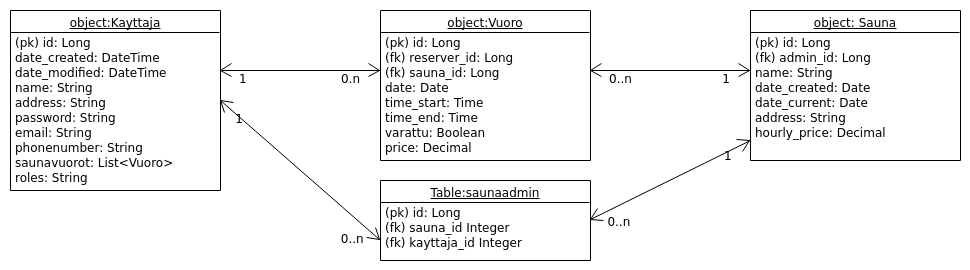

# Dokumentaatio

## Luokat
* Käyttäjä
* Sauna
* Vuoro

## Tietokantakaavio

## User storyt

Eri käyttäjäryhmät:
* Isännöitsijä/huotoyhtiö/admin eli käyttäjä, jolla on role:"ADMIN":
	* voi luoda tunnukset ja kirjautua palveluun
	* voi luoda uuden saunan 
	* voi muokata hallinnoimansa saunan tietoja
	* voi tarkastella saunalistausta 
	* voi poistaa hallinnoimansa saunan
	* voi luoda saunavuoroja
	* voi hallinnoida ja muokata vuoroja ja nähdä, mihin aikaan saunaa pitää lämmittää
	* voi poistaa vuoroja hallinnoimaltaan saunalta
	* voi lisätä saunalle adminkäyttäjän 
	* näkee saunan menneiden ja tulevien vuorojen tulot
	* voi tarkastella yhteenvetoa, jossa näytetään käyttäjän vuorojen määrä ja vuorojen saunat sekä hallinnoitavista saunoista saadut tulot
* Peruskäyttäjä, eli käyttäjä, jolla on role: "USER" tai "ANY":
	* voi luoda tunnukset ja kirjautua palveluun
	* voi tarkastella saunalistausta
	* voi selata saunan saunavuoroja ja muita tietoja
	* varata saunavuoroja
	* voi katsella vuoron tietoja
	* voi vapauttaa oman vuoronsa
	* voi tarkastella yhteenvetoa, jossa näytetään käyttäjän vuorojen määrä ja saunat

## Ohjeet ohjelman käyttöön

* Luo itsellesi uudet tunnukset "Rekisteröidy"-linkin takana olevalla lomakkeella. Vaihtoehtoisesti voit käyttää tunnuksia: käyttäjätunnus: "admin", salasana: "password"
* Jos haluat hallinnoida saunoja valitse "Isännöitsijä / saunan hallitsija"-valintaboksi 
* Selaa saunoja "Saunat"-sivulla
* Katsele yksittäisen saunan tietoja
* Tee varaus linkistä "Tee varaus". Syötä päivämäärä ja muut tiedot ohjeiden mukaan, valitse, onko vuoro varattu vai jätetäänkö se varaamatta, jolloin joku toinen voi varata sen.
* Voit muokata saunan tietoja, jos olet luonut saunan tai olet saunan lisätty admin. Tällöin sinulla tulee olla rekisteröityessäsi valittu "Isännöitsijä"-valintaboksi.
* Voit lisätä saunalle myös uuden adminin "Muuta tietoja"-kohdassa, jos olet kyseisen saunan admin.

## Puutteet ja rajoitteet

* Ohjelmalla on luultavasti turhia dependancyja

## Sovelluksen paikallinen asennusohje
* Mene [Tänne](https://github.com/vipy123/sauna) eli repositorion pääkansioon ja lataa ohjelma zippinä kohdasta "Clone or download"
* Pura zip uuteen kansioon.
* Navigoi terminalissa juurikansioon "neljas" ja asenna ohjelman vaatimat dependancyt käskyllä "pip install -r requirements.txt"
* Tämän jälkeen voit käynnistää ohjelman terminalissa käskyllä "python run.py"
* Voit käyttää ohjelmaa normaalisti selaimessa, osoitteessa: [127.0.0.1:5000/](127.0.0.1:5000/)
* Jos haluat hallinnoida tietokantaa erillisesti, voit paikallisesti hallinnoida sqlite3-kantaa SQL-kielellä terminalissa käskyllä sqlite3 application/vuorot.db

## Tietokannan rakenne
Tietokannat luodaan ohjelman sqlalchemyn tarjomalla toiminnallisuudella automaattisesti. Luotaessa käytetään seuraavia SQL-käskyjä:
CREATE TABLE kayttaja (
	id INTEGER NOT NULL, 
	date_created DATETIME, 
	date_modified DATETIME, 
	username VARCHAR(144) NOT NULL, 
	name VARCHAR(144) NOT NULL, 
	address VARCHAR(200), 
	password VARCHAR(144) NOT NULL, 
	email VARCHAR(144), 
	phonenumber VARCHAR(20), 
	PRIMARY KEY (id)
)

CREATE TABLE sauna (
	id INTEGER NOT NULL, 
	date_created DATE, 
	date_current DATE, 
	name VARCHAR(144) NOT NULL, 
	address VARCHAR(200) NOT NULL, 
	hourly_price NUMERIC(10, 2), 
	PRIMARY KEY (id)
)

CREATE TABLE saunaadmin (
	kayttaja_id INTEGER, 
	sauna_id INTEGER, 
	FOREIGN KEY(kayttaja_id) REFERENCES kayttaja (id), 
	FOREIGN KEY(sauna_id) REFERENCES sauna (id)
)

CREATE TABLE vuoro (
	id INTEGER NOT NULL, 
	reserver_id INTEGER NOT NULL, 
	sauna_id INTEGER NOT NULL, 
	date DATE NOT NULL, 
	time_start TIME NOT NULL, 
	time_end TIME NOT NULL, 
	varattu BOOLEAN, 
	price NUMERIC(10, 2), 
	PRIMARY KEY (id), 
	FOREIGN KEY(reserver_id) REFERENCES kayttaja (id), 
	FOREIGN KEY(sauna_id) REFERENCES sauna (id), 
	CHECK (varattu IN (0, 1))
)

