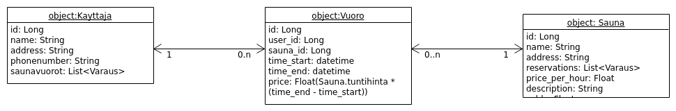

# Dokumentaatio

## Luokat
* Käyttäjä
* Sauna
* Vuoro

## User storyt

Eri käyttäjäryhmät:
-Isännöitsiä/huotoyhtiö/admin:
	-voi luoda uuden saunan ja saunavuorokalenterin
	-hallinnoida vuoroja ja nähdä, mihin aikaan saunaa pitää lämmittää
	(-nähdä saunamaksujen liikenteen/taseen) 
-peruskäyttäjä:
	-voi etsiä saunan osoitteen perusteella
	-luoda tunnukset ja kirjautua palveluun
	-varata ja perua saunavuoroja

